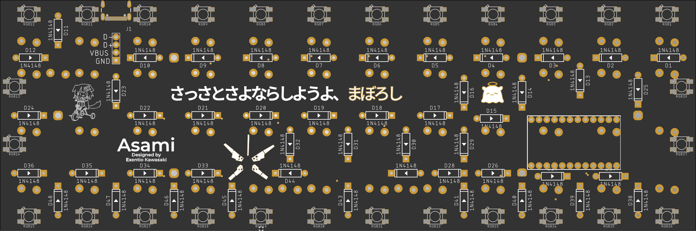

# Asami
Planck-inspired, ALPS-only, bluetooth first keyboard with overkill RGB underglow.



### NOTHING OF THIS IS TESTED

This keyboard has been realized with the [nice!nano](https://nicekeyboards.com/nice-nano) in mind, so it's 
actually compatible with any microcontroller that shares the Pro Micro pinout.  
It purposely lacks MX switches support and a 1x2U config because I couldn't care less.  
This was just for fun and I won't build it until I stop being poor.  

### Case options
While being theoretically Plank-compatible (NOT TESTED), the controller *might* fit, but the battery definitely 
won't, especially not in the Lo-Pro case. The solutions offered are:
+ A middle case for the Planck EOTW kit
	+ Requires the EOTW top and bottom plates, M2 screws, and 11mm standoffs
+ A normal case with bottom holes
	+ Requires a Lo-Pro or EOTW top plate, M2 screws, and 11mm standoffs
+ A case with integrated plate
	+ Can be used as-is for fixed applications, otherwise requires an EOTW bottom plate, M2 screws, and 11mm standoffs

Every case is designed with a 1.6mm PCB in mind. The internal space will be less than 11mm, keep this in mind when
choosing the battery. The hole spacing for the USB breakout board is made for [this board](https://shop.pimoroni.com/products/usb-2-0-type-c-connector-breakout-board-usb07b).

### BOM
```
1x nice!nano or Pro Micro-compatible microcontroller
46-48x ALPS switches
46-48x 1N4148 thru-hole diodes
1x Pololu usb07b Type-C breakout board
1x USB cable compatible with your microcontroller (Type-C for the nice!nano), cut in half and with wires exposed

For every case:
12x M2 screws
6x M2 11mm F-F height standoffs
Planck EOTW parts as needed

Optional:
28x WS2812B LEDs
1x USB4105-GF-A Type-C port (the included cases do NOT support the footprint on the PCB)
2x 2U stabilizers (I suggest trying without)
1x 3.7 LiPo battery (1500+mAh suggested)
```

### Todo
+ Add firmware files
+ Add a JST-PH footprint for the battery
+ Add capacitors for the LEDs
+ ???
+ Test it, duh

### Thanks to
Clueboard for the [Eagle libs](https://github.com/clueboard/eagle_libs).  
Ninomae Ina'nis for being cute and Inugami Korone for being funny.  
Hideo Kojima and Itsue for being god-tier artists, although in different fields.  

### Not thanks to
The whole mechanical keyboard community for spreading detrimental keyboard pseudo-science, inflating prices, 
using limited availability and FOMO as a way to profit, and money as a gatekeeping mechanism. The lack of 
MX support is my middle finger to you.  
Also Blender for being unapologetically Blender.  
